# 实验

<ul>
    <li><a href="#first">实验一</a></li>
    <li><a href="#second">实验二（一）</a></li>
    <li><a href="#second-second">实验二（二）</a></li>
    <li><a href="#third">实验三</a></li>
</ul>

# <p id="first" style="text-align:center">实验一</p>

## 一、Android Studio

## &nbsp;&nbsp;&nbsp;&nbsp;1.版本号

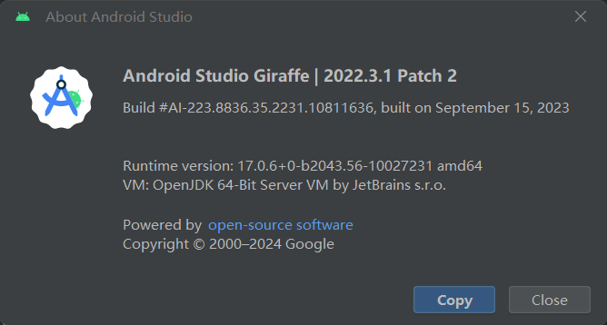

## &nbsp;&nbsp;&nbsp;&nbsp;2.运行截图

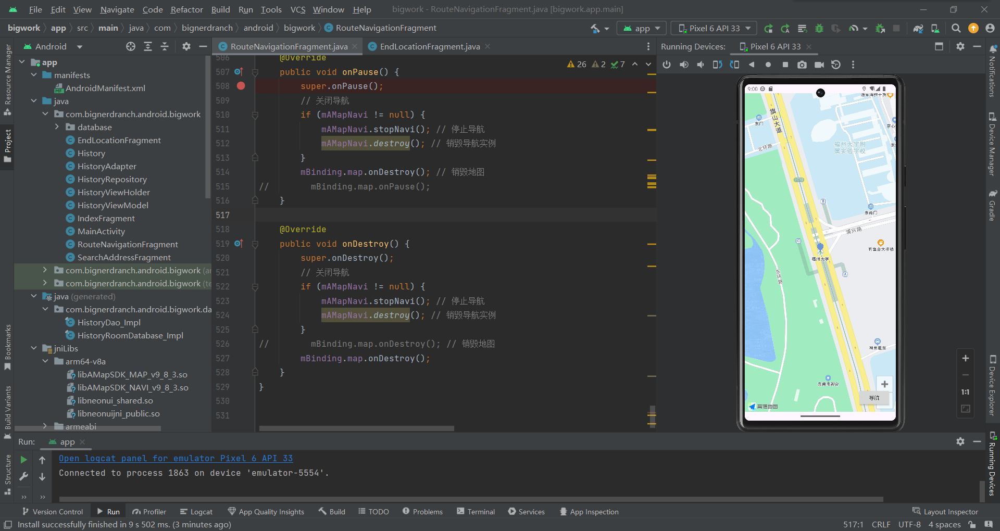

## 二、Jupyter Notebook

## &nbsp;&nbsp;&nbsp;&nbsp;1.目录截图

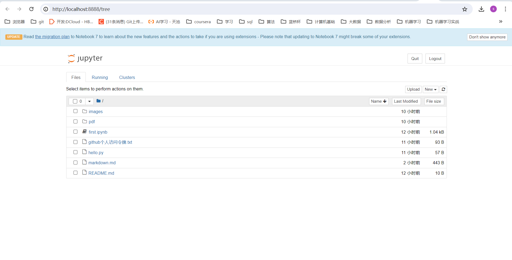

## &nbsp;&nbsp;&nbsp;&nbsp;2.运行截图

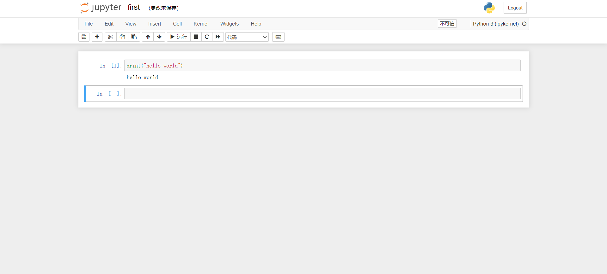

## 三、Anaconda

## &nbsp;&nbsp;&nbsp;&nbsp;1.截图

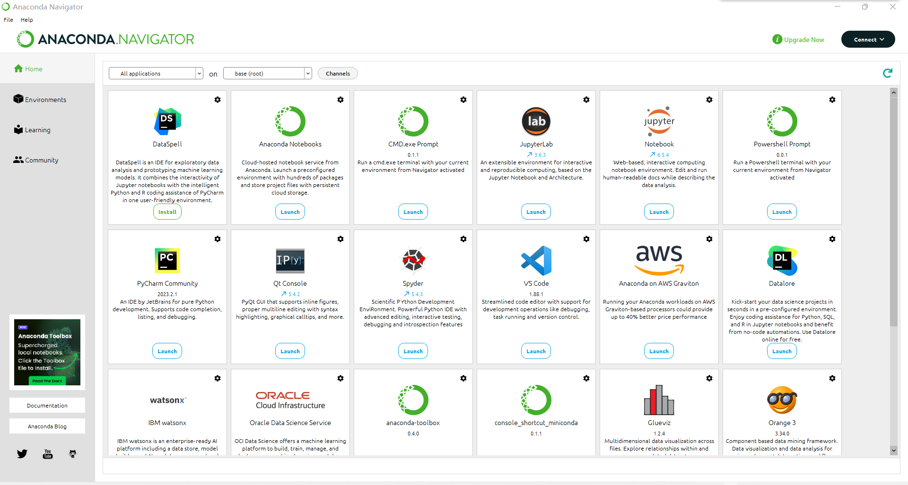

## 四、VS Code

## &nbsp;&nbsp;&nbsp;&nbsp;1.运行截图

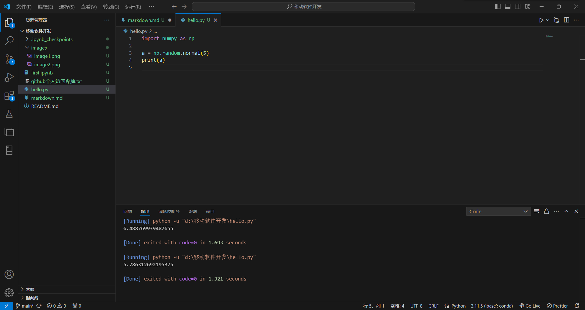
<br /><br /><br/>

# <p id="second" style="text-align:center">实验二（一）</p>

## 1.任务:构建第一个 Kotlin 应用

## 2.创建 Activity

### &emsp;(1) 创建 Basic View Activity(没有 Basic Activity),将其命名为 My Appliaction

#### &emsp;&emsp;a. 创建

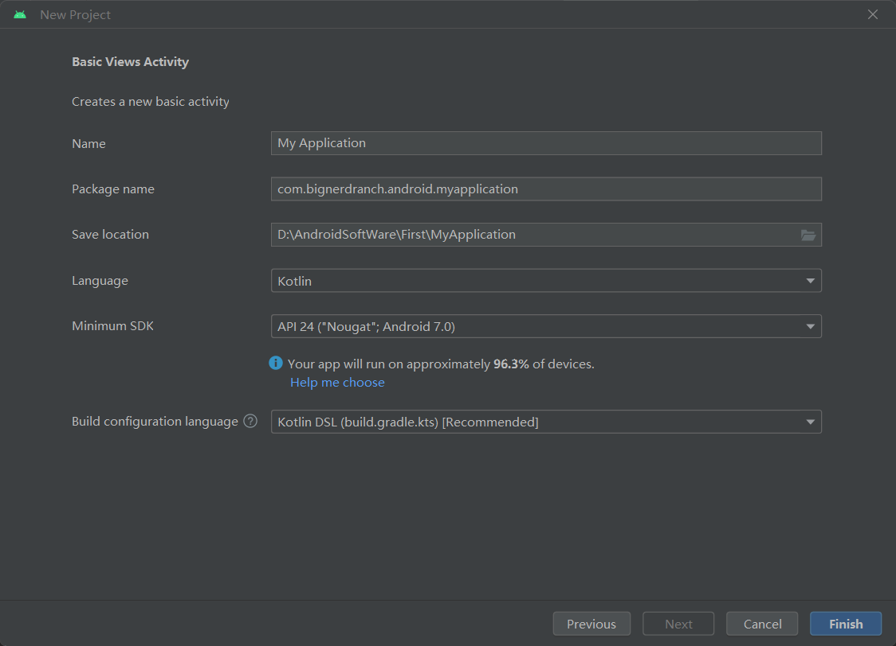

### &emsp;&emsp;b. 生成后的效果如下

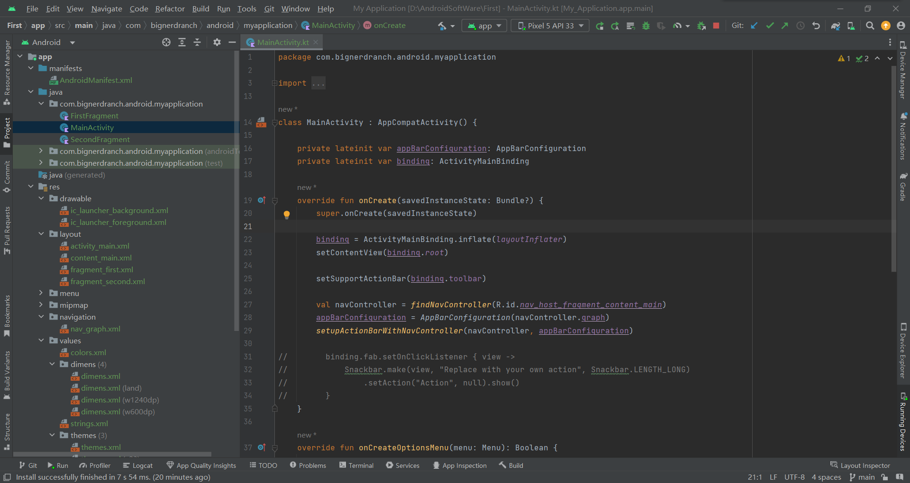

### &emsp;(2) 创建模拟器设备(Pixel5)

#### &emsp;&emsp;a. 创建

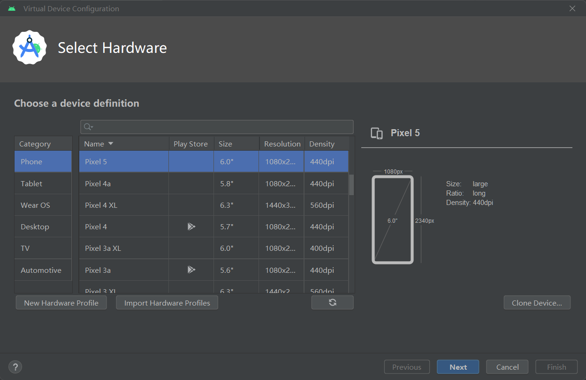

#### &emsp;&emsp;b. 生成结果

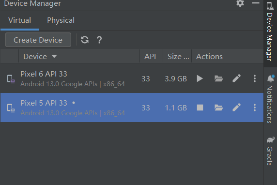

## 3.编写第一个 fragment 的代码

### &emsp;&emsp;(1).编写 xml 文件

#### &emsp;&emsp;&emsp;1)在 strings.xml 文件中添加文本内容

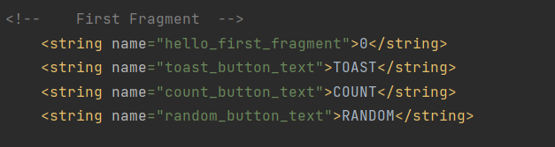

#### &emsp;&emsp;&emsp;2)在 colors.xml 文件中添加颜色内容

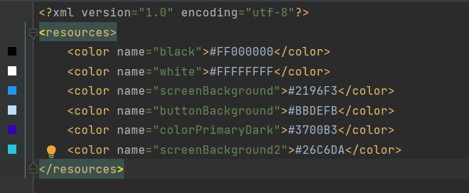

#### &emsp;&emsp;&emsp;3)修改 fragment_first.xml 文件,来显示第一个页面的内容，其中包含一个显示当前计数的 TextView,三个按钮(包括显示 Toast 消息的按钮、点击添加次数的按钮以及跳转到第二个页面的按钮)

#### &emsp;&emsp;&emsp;TextView:<br/>

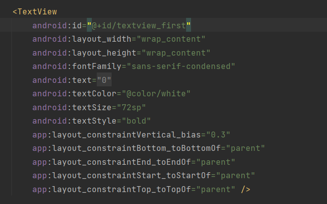

#### &emsp;&emsp;&emsp;Button:<br/>


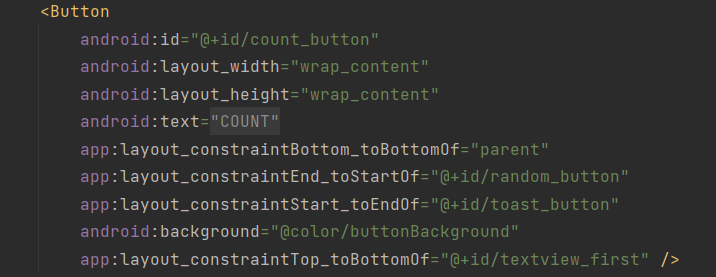

#### &emsp;&emsp;&emsp;4) 修改屏幕的背景色(在 thremes.xml 中进行颜色的修改)

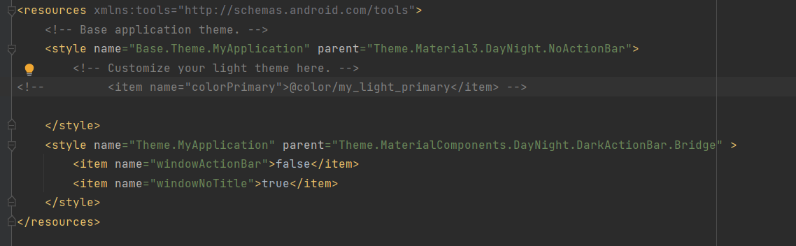

#### &emsp;&emsp;[&nbsp;注意&nbsp;]:&nbsp;在此处要添加上 windowsAction 为 false，否则后面运行时会发生有两个 toolBar 的情况。

#### &emsp;&emsp;&emsp;5) 添加后显示

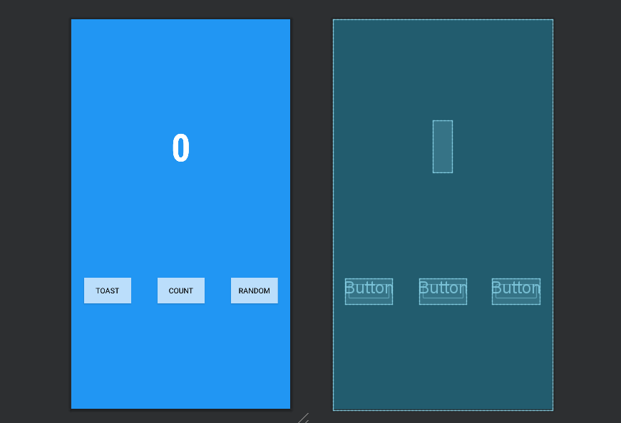

### &emsp;&emsp;(2).编写代码

#### &emsp;&emsp;&emsp;（1）需要实现的功能有三个:

&emsp;&emsp;&emsp;&emsp;&emsp;&emsp;1）点击 TOAST 按钮时，会显示 Hello Toast 的消息<br/>
&emsp;&emsp;&emsp;&emsp;&emsp;&emsp;2）点击 COUNT 按钮时，会更新屏幕上的数字<br/>
&emsp;&emsp;&emsp;&emsp;&emsp;&emsp;3）点击 RANDOM 按钮时，会跳转到第二个页面，同时将当前页面的屏幕上的数字作为参数进行传递。

#### &emsp;&emsp;&emsp;（2）先启动 SafeArgs，以便可以将参数进行传递。分别在两个 build.grandle 中添加相对应的内容或版本,然后同步依赖库，并重新生成工程 Build>Make Project

&emsp;&emsp;&emsp;在 build.grandle(:My_Application)中:<br/>
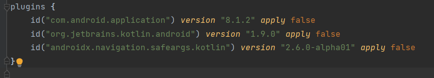
<br/>
&emsp;&emsp;&emsp;在 build.grandle(:My_Application)中:<br/>
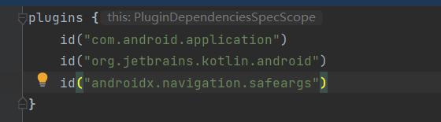
<br/>

#### &emsp;&emsp;&emsp;（3）在 nav_graph.xml 中添加参数

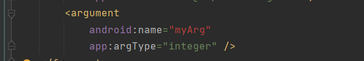

#### &emsp;&emsp;&emsp;（4）编写代码

&emsp;&emsp;&emsp;Toast:<br/>
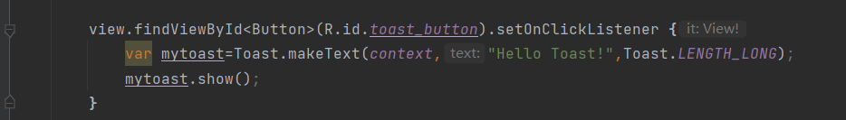
&emsp;&emsp;&emsp;Count:<br/>
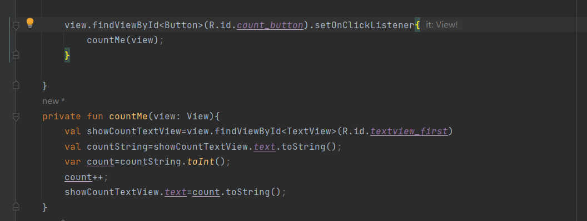
&emsp;&emsp;&emsp;Random:<br/>
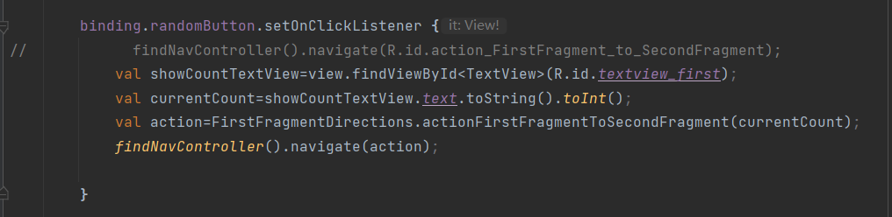

## 4.编写第二个 fragment 的代码

### &emsp;&emsp;(1).编写 xml 文件

#### &emsp;&emsp;&emsp;1)在 strings.xml 文件中添加文本内容

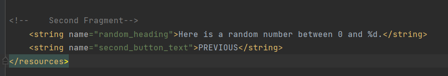

#### &emsp;&emsp;&emsp;3）修改 fragment_second.xml 文件。

&emsp;&emsp;&emsp;&emsp;a.中间屏幕显示一个从 0-count(count 是上一个 fragment 显示的数值)中的一个数字<br/>
&emsp;&emsp;&emsp;&emsp;b.左上角显示一行文字(在 strings.xml 文件中添加),参数由第一个 fragment 传递
&emsp;&emsp;&emsp;&emsp;c.一个 Previous 按钮

#### &emsp;&emsp;&emsp;中间数字 TextView:<br/>

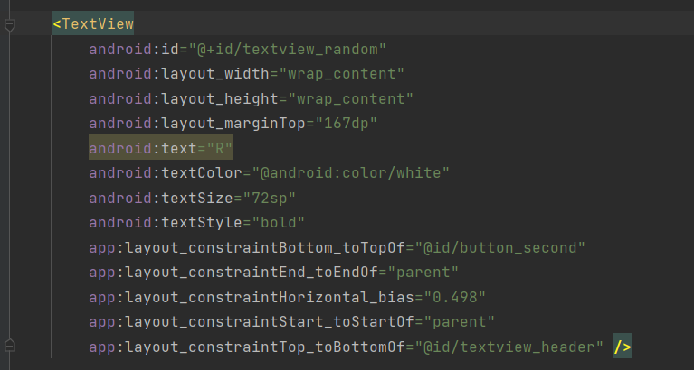

#### &emsp;&emsp;&emsp;左上角 TextView:<br/>

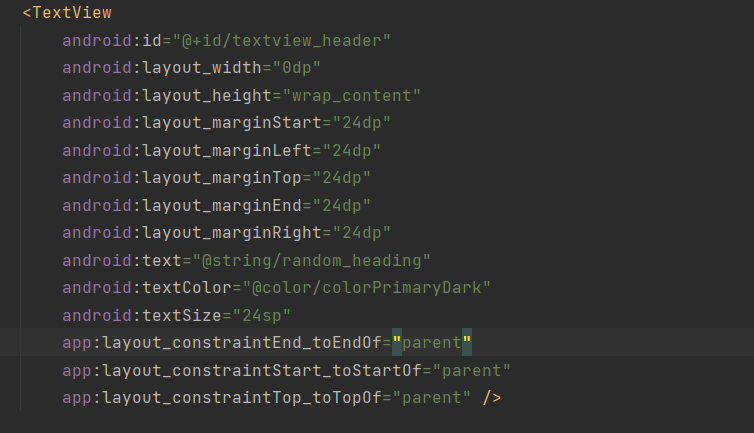

#### &emsp;&emsp;&emsp;Previous Button:<br/>

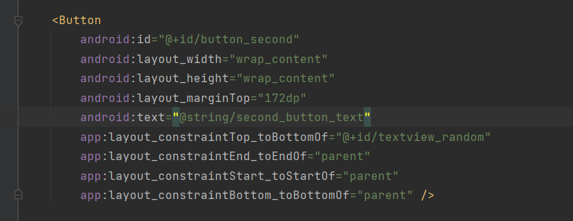

#### &emsp;&emsp;&emsp;4） 添加后显示

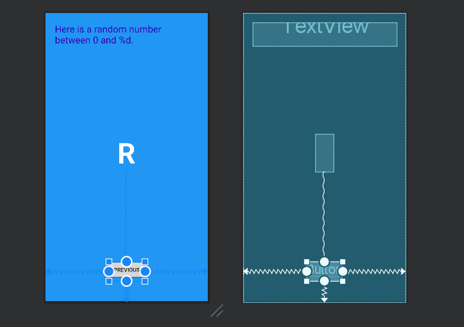

### &emsp;&emsp;(2).编写代码

#### &emsp;&emsp;&emsp;（1）需要实现的功能有三个:

&emsp;&emsp;&emsp;&emsp;&emsp;&emsp;1）随机生成一个 0-count 中的数显示在屏幕中间
&emsp;&emsp;&emsp;&emsp;&emsp;&emsp;2）点击 Previous 按钮，返回第一个页面

#### &emsp;&emsp;&emsp;（2）编写代码

&emsp;&emsp;&emsp;随机显示:<br/>
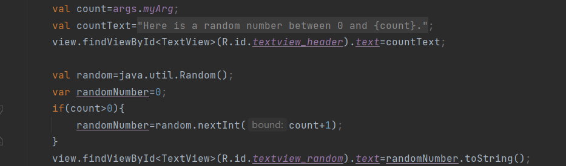
&emsp;&emsp;&emsp;Previous：<br/>
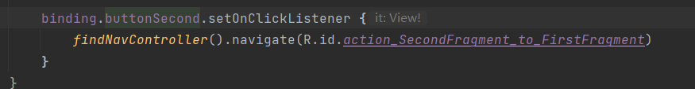

## 5.实现效果如下显示

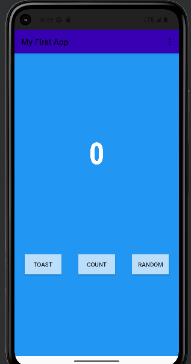

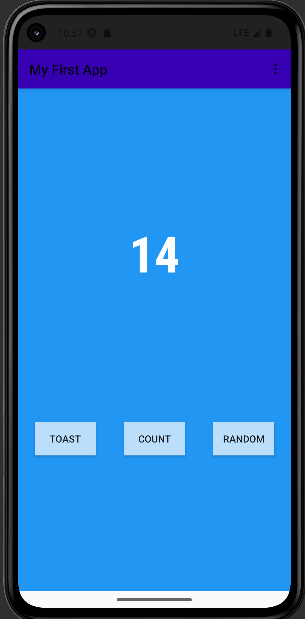
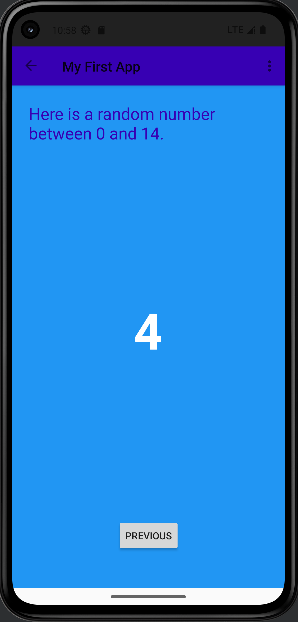
<video controls src="images/second/running.mp4" title="Title"></video>

# <p id="second-second" style="text-alignt:center">实验二（二）</p>

## 1、任务:进行预览、拍照、拍视频和图像分析四个功能

## 2、创建 Activity

### &emsp;(1)本次选择创建一个空的 Activity(Empty Activity),并将其命名为 MyApplication，生成效果如下:


## 3、添加项目依赖

### &emsp;(1)打开 grandle 依赖(在 build.grandle(Module:app)中)，添加 CameraX 依赖项：

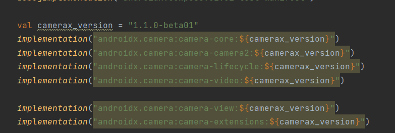
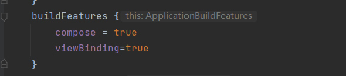

### &emsp;(2)点击 Sync Now 进行同步，就可以在应用中使用 CameraX。

## 4、编写代码

### &emsp;(1)创建项目布局

#### &emsp;&emsp;1）编写 activity_main.xml 文件，包括初始预览相机图片/视频，控制图片拍摄的标准按钮。开始/停止视频拍摄的标准按钮。

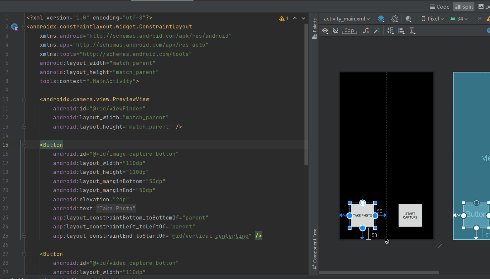
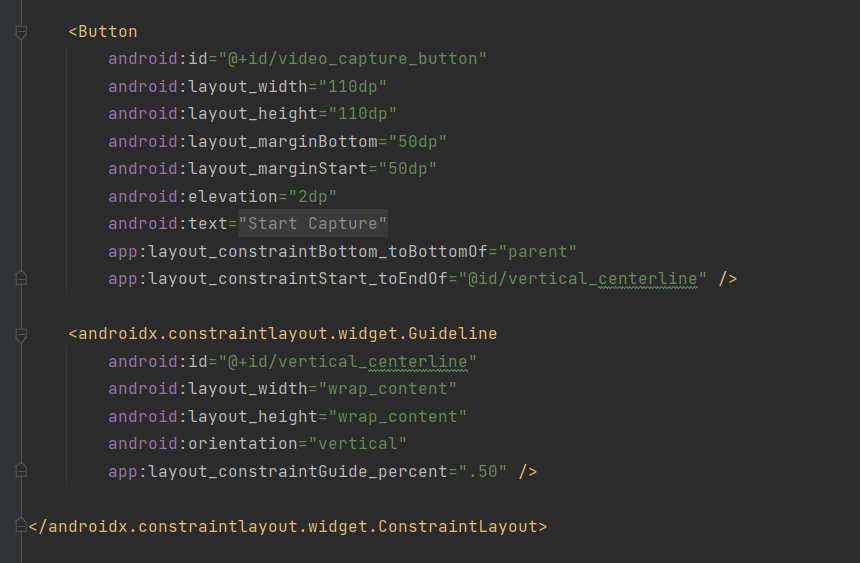

#### &emsp;&emsp;2）编写 strings.xml 文件

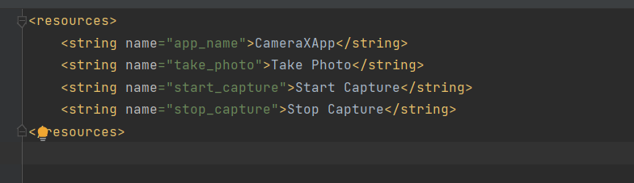

#### &emsp;&emsp;3）呈现的页面效果

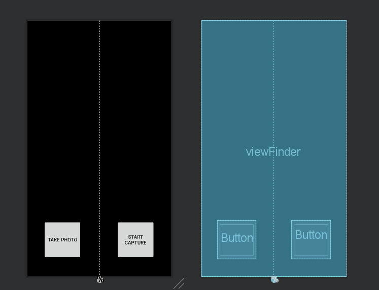

### &emsp;(2)编写 MainActivity.kt 代码

#### &emsp;&emsp;1）进行权限的请求，应用只有获得用户的授权以后才能够打开相机/麦克风等。

<p> &emsp;&emsp;&emsp;a.在AndroidMainfest.xml中添加权限，uses-feature声明应用程序需要访问设备的任意类型的摄像头（包括前后摄像头），uses-permission则是权限声明，声明允许应用程序使用的权限。</p>

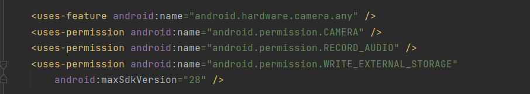

<p> &emsp;&emsp;&emsp;b.在MainActivity.kt中添加代码，判断requestCode代码是否正确，正确的话判断是否授予权限，如果授予权限，则调用startCamera()进行预览，如果没有授予权限，则会产生消息框，提示尚未授予权限。</p>

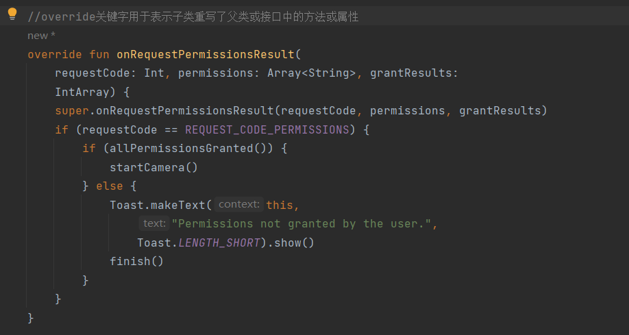

#### &emsp;&emsp;2）如果授予权限，就会进行预览，编写预览的代码。

<p> &emsp;&emsp;&emsp;a.在相机应用中，取景器用于让用户预览他们拍摄的照片,此处使用CameraX中的Preview类实现相机预览，并设置预览的。</p>
<p> &emsp;&emsp;&emsp;b.创建ProcessCameraProvider实例，，负责管理相机的生命周期，并添加监听器，将ContextCompat.getMainExectuor()作为第二个参数，返回一个在主线程上运行的Executor</p>
<p> &emsp;&emsp;&emsp;c.添加ProcessCameraProvider,将相机的生命周期绑定到应用进程的LifecycleOwner,并初始化Preview对象，调用build，获取Surface,并在预览上进行设置。</p>
<p> &emsp;&emsp;&emsp;d.创建CameraSelector对象，选择DEFAULT_BACK_CAMERA,并在try代码块中和预览对象绑定到cameraProvider中</p>

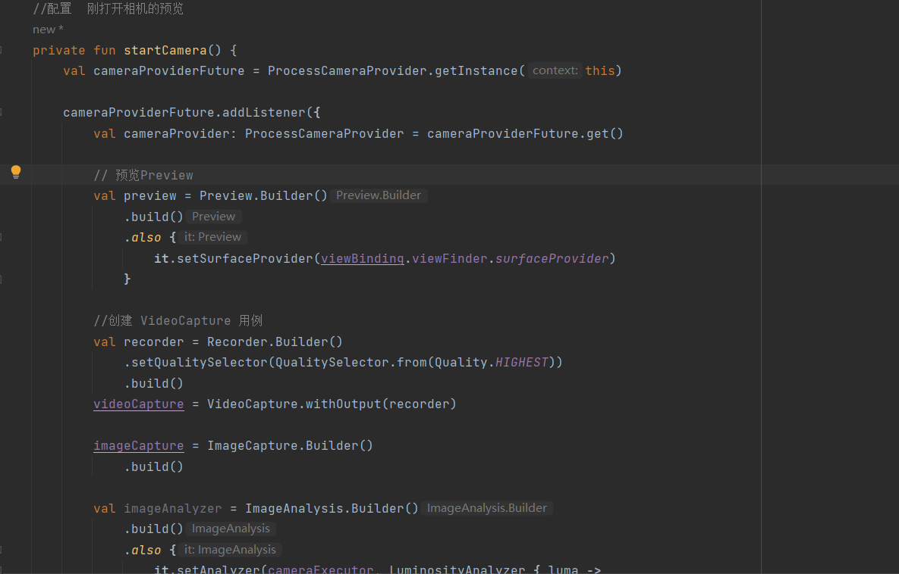
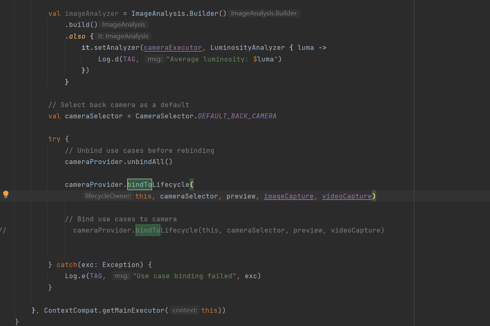

#### &emsp;&emsp;3）编写拍照功能的代码。

<p> &emsp;&emsp;&emsp;a.编写takePhoto()方法来实现拍摄照片的功能。获取对ImageCapture用例的引用。如果在设置图片拍摄之前点按“photo”按钮，它将为null此时执行return,如果没有 return 语句，应用会在该用例为 null时崩溃。</p>
<p> &emsp;&emsp;&emsp;b.创建用于保存图片的MediaStore内容值,确保MediaStore中的显示名是唯一的。</p>
<p> &emsp;&emsp;&emsp;c.创建一个OutputFileOptions对象,指定所需的输出内容，并添加MediaStore条目，将输出保存在MediaStore中，使得其他应用可以显示它。</p>
<p> &emsp;&emsp;&emsp;d.对imageCapture 对象调用takePicture()。传入 outputOptions、执行器和保存图片时使用的回调。如果图片拍摄失败或保存图片失败，添加错误情况，如果拍摄成功，将照片保存到之前创建的文件中，并显示消息框，输出日志语句。</p>
<p> &emsp;&emsp;&emsp;e.可以在本地的图片库查看刚刚拍摄的图片</p>

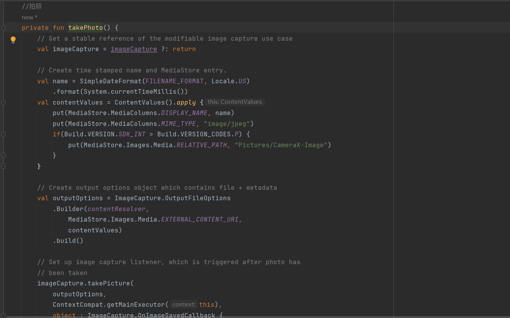
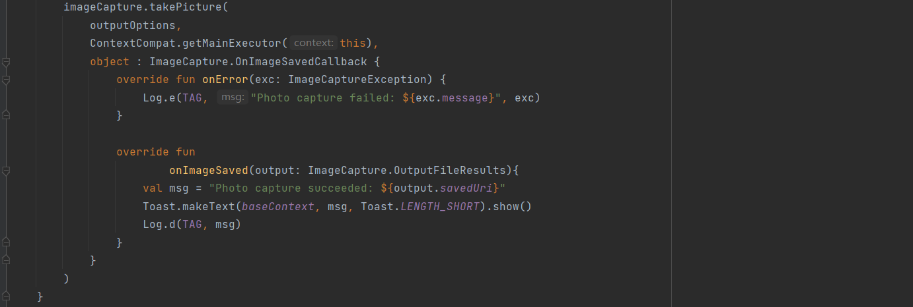

#### &emsp;&emsp;4）实时处理相机帧，编写代码，采用 ImageAnalysis 类。

<p> &emsp;&emsp;&emsp;a.实现ImageAnalysis.Analyzer接口的自定义类，并使用传入的相机帧调用该类,将其绑定到应用所需的生命周期上。</p>
<p> &emsp;&emsp;&emsp;b.实现ImageAnalysis.Analyzer接口的类中的 analyze函数创建分析器，记录图像的平均亮度，并将此分析器添加为MainActivity.kt中的内部类。</p>
<p> &emsp;&emsp;&emsp;c.只需在 mageAnalysis中实例化一个 LuminosityAnalyzer实例，并更新startCamera()函数，然后调用CameraX.bindToLifecycle()，包含imageAnalyzer。</p>

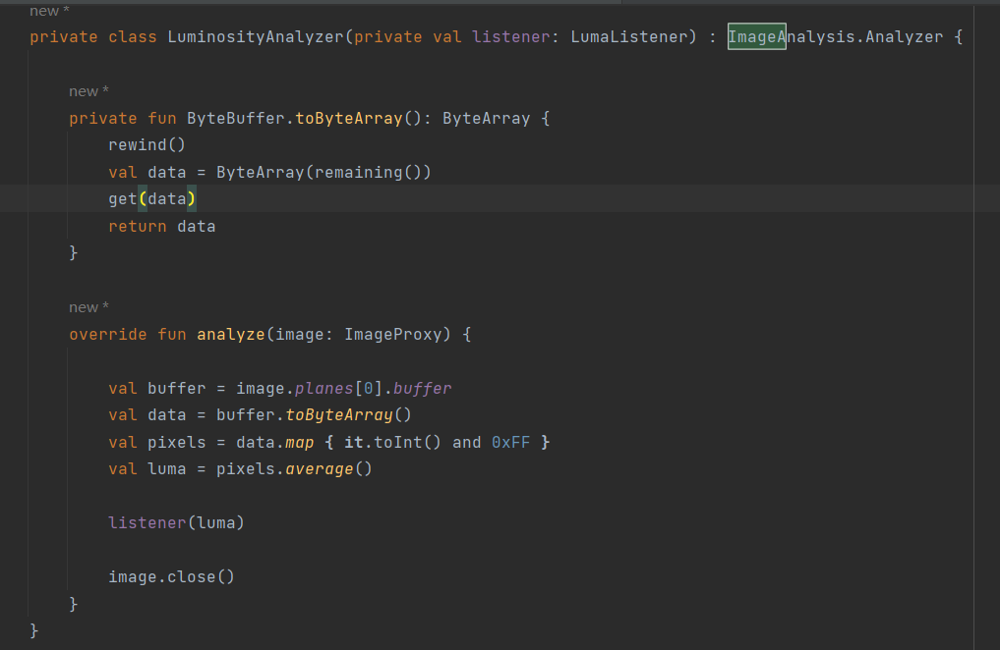
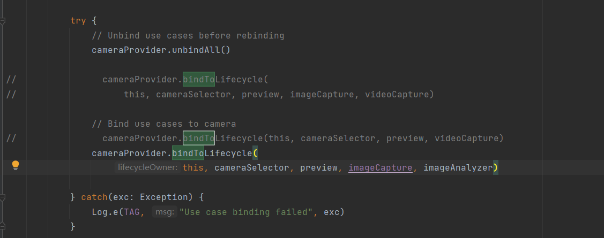

#### &emsp;&emsp;4）拍摄视频，编写 captureVideo()代码。

<p> &emsp;&emsp;&emsp;a.首先检查是否已创建VideoCapture用例,如果尚未创建，则不执行任何操作。否则，在CameraX完成请求操作之前，停用界面，之后在已注册的VideoRecordListener内重新启用。</p>
<p> &emsp;&emsp;&emsp;b.如果有正在进行的录制操作，将其停止并释放当前的 recording。</p>
<p> &emsp;&emsp;&emsp;c.创建一个新的录制会话，创建预定的 MediaStore视频内容对象，将系统时间戳作为显示名，方便捕获多个视频。将创建的视频contentValues设置为 MediaStoreOutputOptions.Builder，并构建实例。同时将输出选项配置为VideoCapture的Recorder并启用录音，并启动音频。</p>
<p> &emsp;&emsp;&emsp;d.启动这项新录制内容，并注册一个监听器。当相机开始请求录制时，会将“Start Capture”按钮文本切换为“Stop Capture”。完结束后，会进行通知，并将按钮切换回来。</p>
<p> &emsp;&emsp;&emsp;e.更新startCamera()，将 Preview + VideoCapture+ImageCapture用例绑定到生命周期相机。</p>

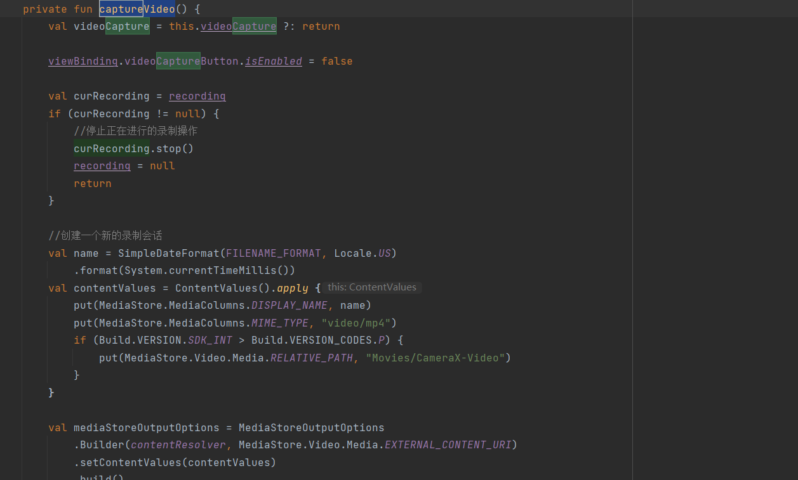
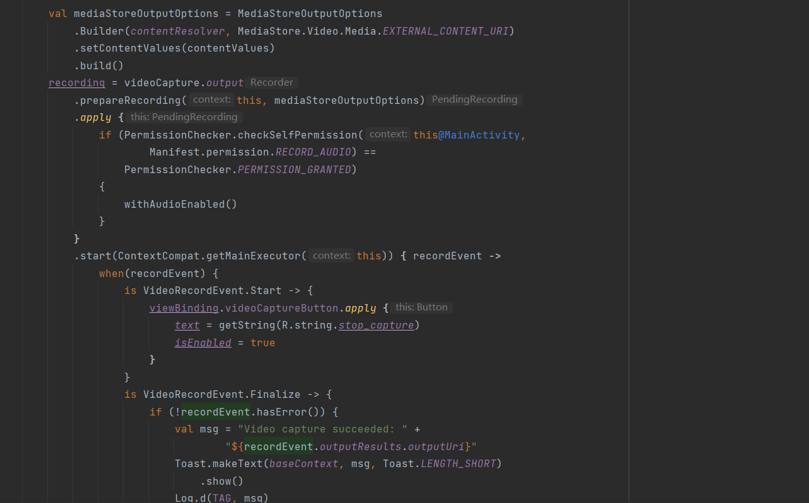
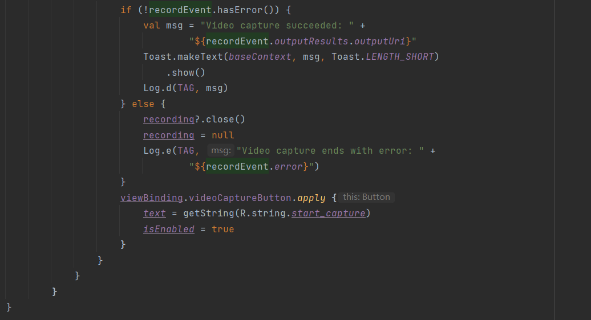
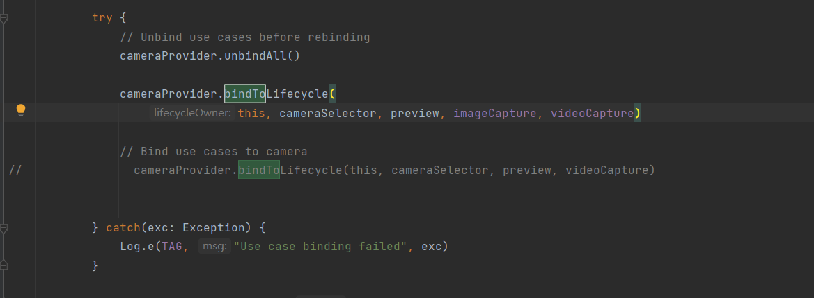

## 5、效果展示

图片: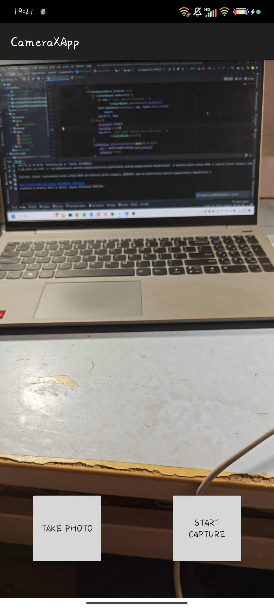

运行视频录制：<video controls src="images/third/running.mp4" title="Title"></video>

# <p id="third" style="text-alignt:center">实验三</p>

## 一、排序

```python
# 选择排序 从大到小排序
def selection_sort(a):
    t=0
    for j in range(len(a)):
        maxx=0
        for i in range(j,len(a)):
            if maxx<a[i]:
                maxx=a[i]
                t=i
        x=a[t]
        a[t]=a[j]
        a[j]=x
```

```python
def test_sort():
    a=list(map(int,input().split(",")))
    selection_sort(a)
    print(a)
```

```python
# 排序  调用
test_sort()
```

    5,2,3,6,9
    [9, 6, 5, 3, 2]

## 二、数据分析

```python
# 导包
%matplotlib inline
import pandas as pd
import matplotlib.pyplot as plt
import seaborn as sns
```

```python
# 读取文件
data=pd.read_csv("fortune500.csv")
```

```python
# 输出前5行
data.head()
```

<div>
<style scoped>
    .dataframe tbody tr th:only-of-type {
        vertical-align: middle;
    }

    .dataframe tbody tr th {
        vertical-align: top;
    }

    .dataframe thead th {
        text-align: right;
    }

</style>
<table border="1" class="dataframe">
  <thead>
    <tr style="text-align: right;">
      <th></th>
      <th>Year</th>
      <th>Rank</th>
      <th>Company</th>
      <th>Revenue (in millions)</th>
      <th>Profit (in millions)</th>
    </tr>
  </thead>
  <tbody>
    <tr>
      <th>0</th>
      <td>1955</td>
      <td>1</td>
      <td>General Motors</td>
      <td>9823.5</td>
      <td>806</td>
    </tr>
    <tr>
      <th>1</th>
      <td>1955</td>
      <td>2</td>
      <td>Exxon Mobil</td>
      <td>5661.4</td>
      <td>584.8</td>
    </tr>
    <tr>
      <th>2</th>
      <td>1955</td>
      <td>3</td>
      <td>U.S. Steel</td>
      <td>3250.4</td>
      <td>195.4</td>
    </tr>
    <tr>
      <th>3</th>
      <td>1955</td>
      <td>4</td>
      <td>General Electric</td>
      <td>2959.1</td>
      <td>212.6</td>
    </tr>
    <tr>
      <th>4</th>
      <td>1955</td>
      <td>5</td>
      <td>Esmark</td>
      <td>2510.8</td>
      <td>19.1</td>
    </tr>
  </tbody>
</table>
</div>

```python
# 读取后5行
data.tail()
```

<div>
<style scoped>
    .dataframe tbody tr th:only-of-type {
        vertical-align: middle;
    }

    .dataframe tbody tr th {
        vertical-align: top;
    }

    .dataframe thead th {
        text-align: right;
    }

</style>
<table border="1" class="dataframe">
  <thead>
    <tr style="text-align: right;">
      <th></th>
      <th>Year</th>
      <th>Rank</th>
      <th>Company</th>
      <th>Revenue (in millions)</th>
      <th>Profit (in millions)</th>
    </tr>
  </thead>
  <tbody>
    <tr>
      <th>25495</th>
      <td>2005</td>
      <td>496</td>
      <td>Wm. Wrigley Jr.</td>
      <td>3648.6</td>
      <td>493</td>
    </tr>
    <tr>
      <th>25496</th>
      <td>2005</td>
      <td>497</td>
      <td>Peabody Energy</td>
      <td>3631.6</td>
      <td>175.4</td>
    </tr>
    <tr>
      <th>25497</th>
      <td>2005</td>
      <td>498</td>
      <td>Wendy's International</td>
      <td>3630.4</td>
      <td>57.8</td>
    </tr>
    <tr>
      <th>25498</th>
      <td>2005</td>
      <td>499</td>
      <td>Kindred Healthcare</td>
      <td>3616.6</td>
      <td>70.6</td>
    </tr>
    <tr>
      <th>25499</th>
      <td>2005</td>
      <td>500</td>
      <td>Cincinnati Financial</td>
      <td>3614.0</td>
      <td>584</td>
    </tr>
  </tbody>
</table>
</div>

```python
# 修改属性名称
data.columns=['year', 'rank', 'company', 'revenue', 'profit']
data.head()
```

<div>
<style scoped>
    .dataframe tbody tr th:only-of-type {
        vertical-align: middle;
    }

    .dataframe tbody tr th {
        vertical-align: top;
    }

    .dataframe thead th {
        text-align: right;
    }

</style>
<table border="1" class="dataframe">
  <thead>
    <tr style="text-align: right;">
      <th></th>
      <th>year</th>
      <th>rank</th>
      <th>company</th>
      <th>revenue</th>
      <th>profit</th>
    </tr>
  </thead>
  <tbody>
    <tr>
      <th>0</th>
      <td>1955</td>
      <td>1</td>
      <td>General Motors</td>
      <td>9823.5</td>
      <td>806</td>
    </tr>
    <tr>
      <th>1</th>
      <td>1955</td>
      <td>2</td>
      <td>Exxon Mobil</td>
      <td>5661.4</td>
      <td>584.8</td>
    </tr>
    <tr>
      <th>2</th>
      <td>1955</td>
      <td>3</td>
      <td>U.S. Steel</td>
      <td>3250.4</td>
      <td>195.4</td>
    </tr>
    <tr>
      <th>3</th>
      <td>1955</td>
      <td>4</td>
      <td>General Electric</td>
      <td>2959.1</td>
      <td>212.6</td>
    </tr>
    <tr>
      <th>4</th>
      <td>1955</td>
      <td>5</td>
      <td>Esmark</td>
      <td>2510.8</td>
      <td>19.1</td>
    </tr>
  </tbody>
</table>
</div>

```python
len(data)
```

    25500

```python
# 得到各属性的类型
data.dtypes
```

    year         int64
    rank         int64
    company     object
    revenue    float64
    profit      object
    dtype: object

```python
# 对于profit类 期望结果是float类型 其中可能包含非数值型  利用正则表达式进行检查
non_numberic_profits=data.profit.str.contains('[^0-9.-]')
data.loc[non_numberic_profits].head()
```

<div>
<style scoped>
    .dataframe tbody tr th:only-of-type {
        vertical-align: middle;
    }

    .dataframe tbody tr th {
        vertical-align: top;
    }

    .dataframe thead th {
        text-align: right;
    }

</style>
<table border="1" class="dataframe">
  <thead>
    <tr style="text-align: right;">
      <th></th>
      <th>year</th>
      <th>rank</th>
      <th>company</th>
      <th>revenue</th>
      <th>profit</th>
    </tr>
  </thead>
  <tbody>
    <tr>
      <th>228</th>
      <td>1955</td>
      <td>229</td>
      <td>Norton</td>
      <td>135.0</td>
      <td>N.A.</td>
    </tr>
    <tr>
      <th>290</th>
      <td>1955</td>
      <td>291</td>
      <td>Schlitz Brewing</td>
      <td>100.0</td>
      <td>N.A.</td>
    </tr>
    <tr>
      <th>294</th>
      <td>1955</td>
      <td>295</td>
      <td>Pacific Vegetable Oil</td>
      <td>97.9</td>
      <td>N.A.</td>
    </tr>
    <tr>
      <th>296</th>
      <td>1955</td>
      <td>297</td>
      <td>Liebmann Breweries</td>
      <td>96.0</td>
      <td>N.A.</td>
    </tr>
    <tr>
      <th>352</th>
      <td>1955</td>
      <td>353</td>
      <td>Minneapolis-Moline</td>
      <td>77.4</td>
      <td>N.A.</td>
    </tr>
  </tbody>
</table>
</div>

```python
len(data.profit[non_numberic_profits])
```

    369

```python
# 绘制柱形图
bin_sizes, _, _ = plt.hist(data.year[non_numberic_profits], bins=range(1955, 2006))
```

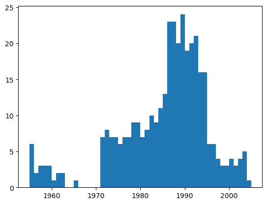

```python
# 单独年份记录数都少于25条，即少于4%的比例 可以接受  直接删除
data=data.loc[-non_numberic_profits]
data.profit=data.profit.apply(pd.to_numeric)
```

```python
len(data)
```

    25131

```python
data.dtypes
```

    year         int64
    rank         int64
    company     object
    revenue    float64
    profit     float64
    dtype: object

```python
# 绘图
group_by_year=data.loc[:,['year','revenue','profit']].groupby('year')
avgs=group_by_year.mean()
x=avgs.index
y1=avgs.profit
```

```python
def plot(x,y,ax,title,y_label):
    ax.set_title(title)
    ax.set_ylabel(y_label)
    ax.plot(x,y)
    ax.margins(x=0,y=0)
```

```python
# 绘图
fig,ax=plt.subplots()
plot(x,y1,ax,'Increase in mean Fortune 500 company profits from 1955 to 2005', 'Profit (millions)')
```

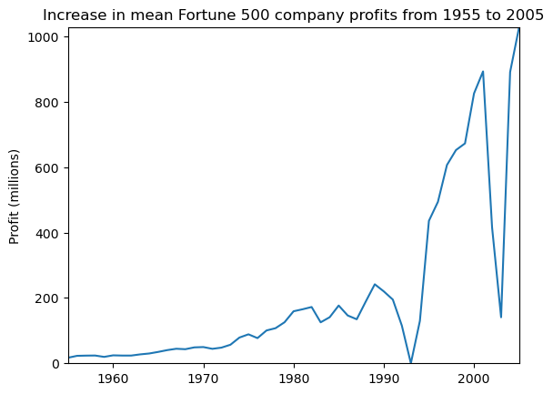

```python
y2 = avgs.revenue
fig, ax = plt.subplots()
plot(x, y2, ax, 'Increase in mean Fortune 500 company revenues from 1955 to 2005', 'Revenue (millions)')
```

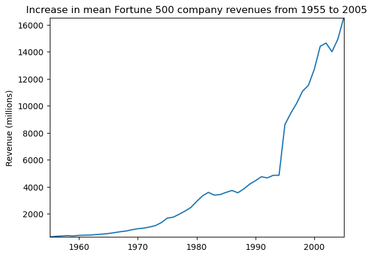

```python
def plot_with_std(x, y, stds, ax, title, y_label):
    ax.fill_between(x, y - stds, y + stds, alpha=0.2)
    plot(x, y, ax, title, y_label)
```

```python
fig, (ax1, ax2) = plt.subplots(ncols=2)
title = 'Increase in mean and std Fortune 500 company %s from 1955 to 2005'
stds1 = group_by_year.std().profit.values
stds2 = group_by_year.std().revenue.values
plot_with_std(x, y1.values, stds1, ax1, title % 'profits', 'Profit (millions)')
plot_with_std(x, y2.values, stds2, ax2, title % 'revenues', 'Revenue (millions)')
fig.set_size_inches(14, 4)
fig.tight_layout()
```

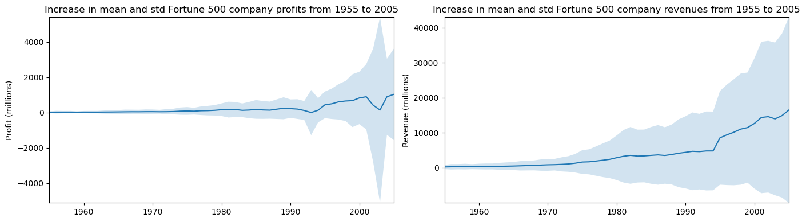

```python

```
