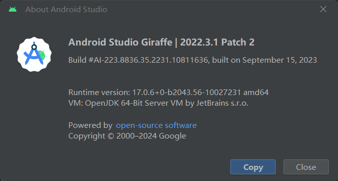
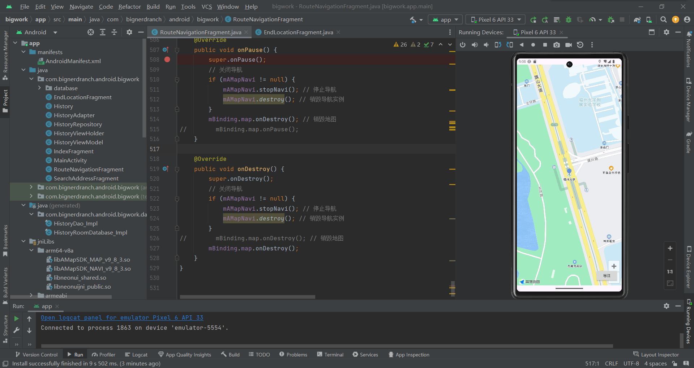
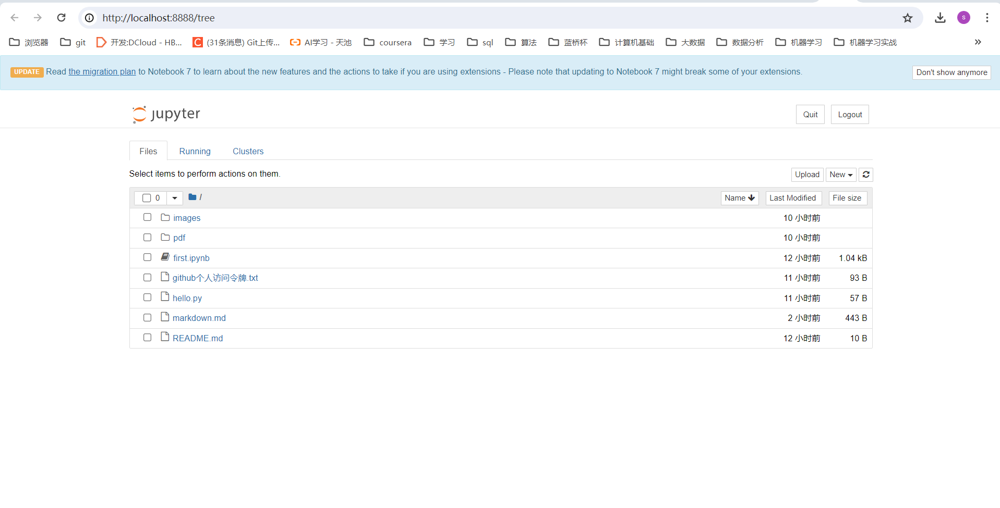
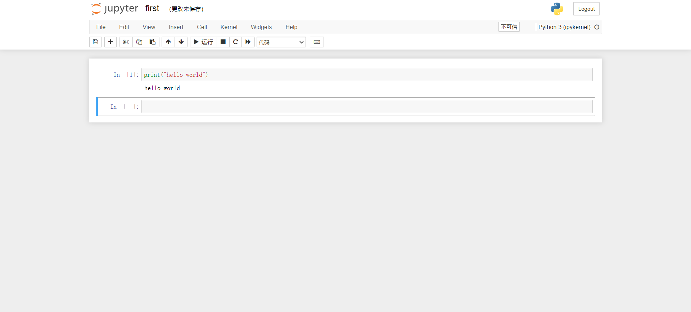
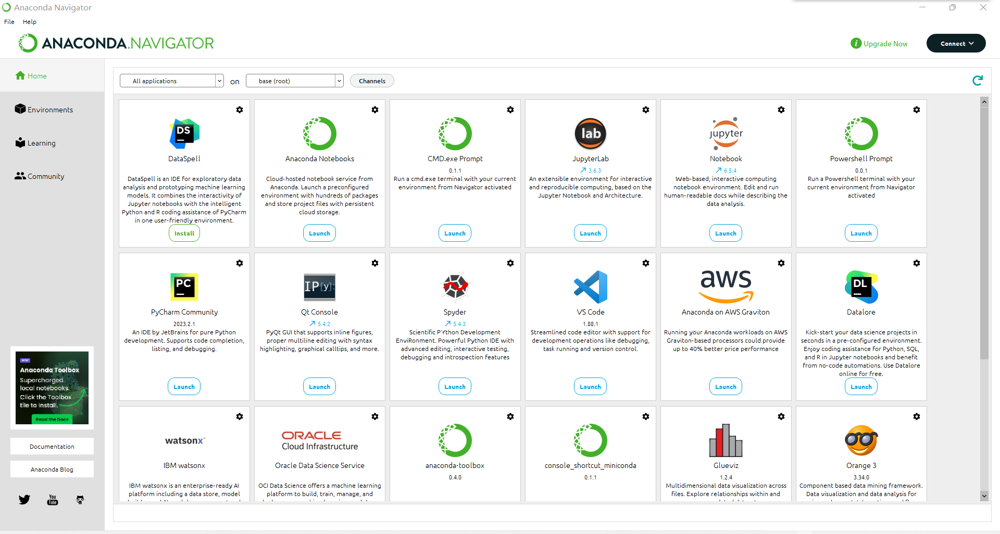
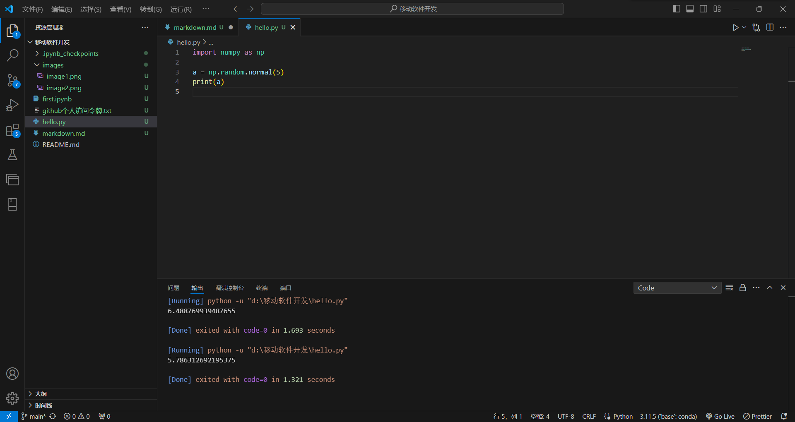

# 一、Android Studio

## &nbsp;&nbsp;&nbsp;&nbsp;1.版本号

## &nbsp;&nbsp;&nbsp;&nbsp;2.运行截图

# 二、Jupyter Notebook

## &nbsp;&nbsp;&nbsp;&nbsp;1.目录截图

## &nbsp;&nbsp;&nbsp;&nbsp;2.运行截图

# 三、Anaconda

## &nbsp;&nbsp;&nbsp;&nbsp;1.截图

# 四、VS Code

## &nbsp;&nbsp;&nbsp;&nbsp;1.运行截图

