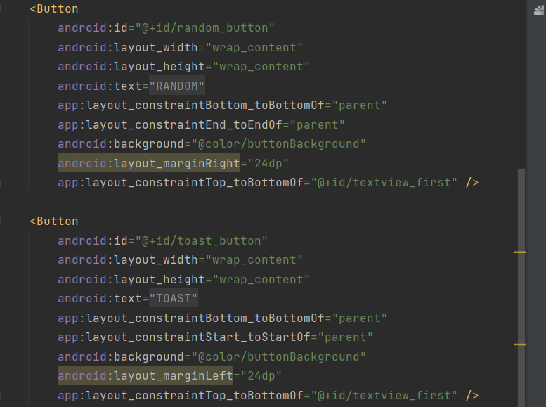

# 实验

<ul>
    <li><a href="#first">实验一</a></li>
    <li><a href="#second">实验二</a></li>
</ul>

# 
实验一

# 一、Android Studio

## &nbsp;&nbsp;&nbsp;&nbsp;1.版本号

## &nbsp;&nbsp;&nbsp;&nbsp;2.运行截图

# 二、Jupyter Notebook

## &nbsp;&nbsp;&nbsp;&nbsp;1.目录截图

## &nbsp;&nbsp;&nbsp;&nbsp;2.运行截图

# 三、Anaconda

## &nbsp;&nbsp;&nbsp;&nbsp;1.截图

# 四、VS Code

## &nbsp;&nbsp;&nbsp;&nbsp;1.运行截图

   

# 
实验二

## 1.任务:构建第一个 Kotlin 应用

## 2.创建 Activity

### &emsp;(1) 创建 Basic View Activity(没有 Basic Activity),将其命名为 My Appliaction

#### &emsp;&emsp;a. 创建

### &emsp;&emsp;b. 生成后的效果如下

### &emsp;(2) 创建模拟器设备(Pixel5)

#### &emsp;&emsp;a. 创建

#### &emsp;&emsp;b. 生成结果

## 3.编写第一个 fragment 的代码

### &emsp;&emsp;(1).编写 xml 文件

#### &emsp;&emsp;&emsp;1)在 strings.xml 文件中添加文本内容

#### &emsp;&emsp;&emsp;2)在 colors.xml 文件中添加颜色内容

#### &emsp;&emsp;&emsp;3)修改 fragment_first.xml 文件,来显示第一个页面的内容，其中包含一个显示当前计数的 TextView,三个按钮(包括显示 Toast 消息的按钮、点击添加次数的按钮以及跳转到第二个页面的按钮)

#### &emsp;&emsp;&emsp;TextView: 

#### &emsp;&emsp;&emsp;Button: 

#### &emsp;&emsp;&emsp;4) 修改屏幕的背景色(在 thremes.xml 中进行颜色的修改)

#### &emsp;&emsp;[&nbsp;注意&nbsp;]:&nbsp;在此处要添加上 windowsAction 为 false，否则后面运行时会发生有两个 toolBar 的情况。

#### &emsp;&emsp;&emsp;5) 添加后显示

### &emsp;&emsp;(2).编写代码

#### &emsp;&emsp;&emsp;（1）需要实现的功能有三个:

&emsp;&emsp;&emsp;&emsp;&emsp;&emsp;1）点击 TOAST 按钮时，会显示 Hello Toast 的消息 
&emsp;&emsp;&emsp;&emsp;&emsp;&emsp;2）点击 COUNT 按钮时，会更新屏幕上的数字 
&emsp;&emsp;&emsp;&emsp;&emsp;&emsp;3）点击 RANDOM 按钮时，会跳转到第二个页面，同时将当前页面的屏幕上的数字作为参数进行传递。

#### &emsp;&emsp;&emsp;（2）先启动 SafeArgs，以便可以将参数进行传递。分别在两个 build.grandle 中添加相对应的内容或版本,然后同步依赖库，并重新生成工程 Build>Make Project

&emsp;&emsp;&emsp;在 build.grandle(:My_Application)中: 

 
&emsp;&emsp;&emsp;在 build.grandle(:My_Application)中: 

 

#### &emsp;&emsp;&emsp;（3）在 nav_graph.xml 中添加参数

#### &emsp;&emsp;&emsp;（4）编写代码

&emsp;&emsp;&emsp;Toast: 

&emsp;&emsp;&emsp;Count: 

&emsp;&emsp;&emsp;Random: 

## 4.编写第二个 fragment 的代码

### &emsp;&emsp;(1).编写 xml 文件

#### &emsp;&emsp;&emsp;1)在 strings.xml 文件中添加文本内容

#### &emsp;&emsp;&emsp;3）修改 fragment_second.xml 文件。

&emsp;&emsp;&emsp;&emsp;a.中间屏幕显示一个从 0-count(count 是上一个 fragment 显示的数值)中的一个数字 
&emsp;&emsp;&emsp;&emsp;b.左上角显示一行文字(在 strings.xml 文件中添加),参数由第一个 fragment 传递
&emsp;&emsp;&emsp;&emsp;c.一个 Previous 按钮

#### &emsp;&emsp;&emsp;中间数字 TextView: 

#### &emsp;&emsp;&emsp;左上角 TextView: 

#### &emsp;&emsp;&emsp;Previous Button: 

#### &emsp;&emsp;&emsp;4） 添加后显示

### &emsp;&emsp;(2).编写代码

#### &emsp;&emsp;&emsp;（1）需要实现的功能有三个:

&emsp;&emsp;&emsp;&emsp;&emsp;&emsp;1）随机生成一个 0-count 中的数显示在屏幕中间
&emsp;&emsp;&emsp;&emsp;&emsp;&emsp;2）点击 Previous 按钮，返回第一个页面

#### &emsp;&emsp;&emsp;（2）编写代码

&emsp;&emsp;&emsp;随机显示: 

&emsp;&emsp;&emsp;Previous： 

## 5.实现效果如下显示

<video controls src="images/second/running.mp4" title="Title"></video>
